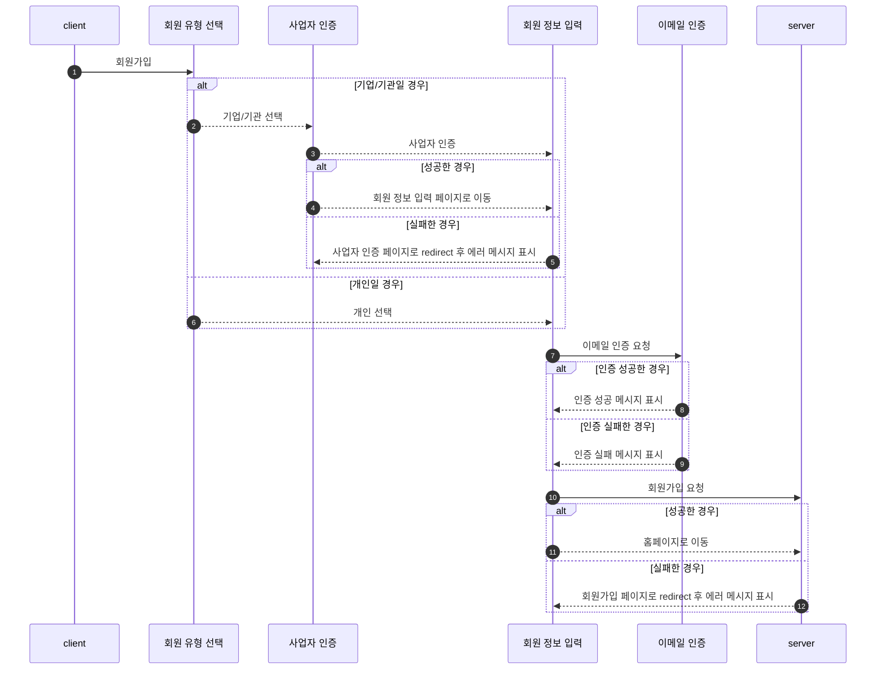
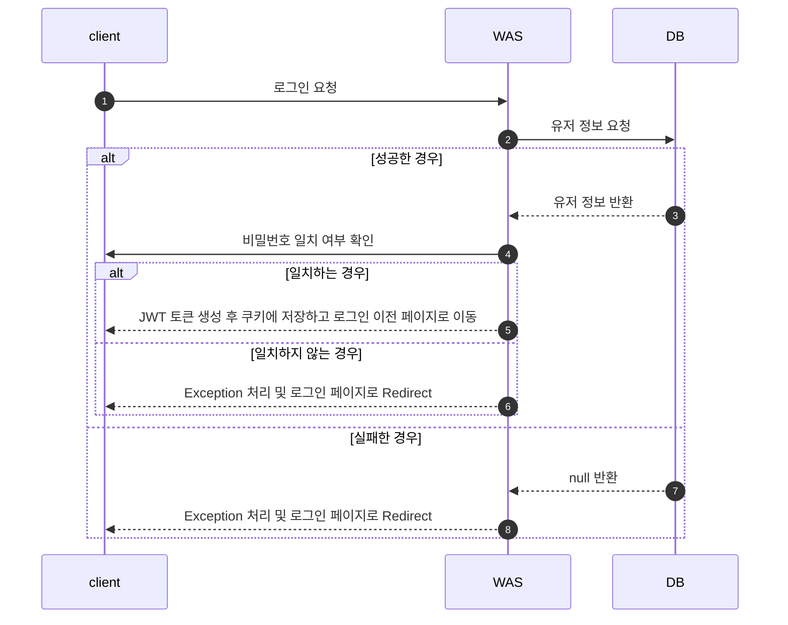
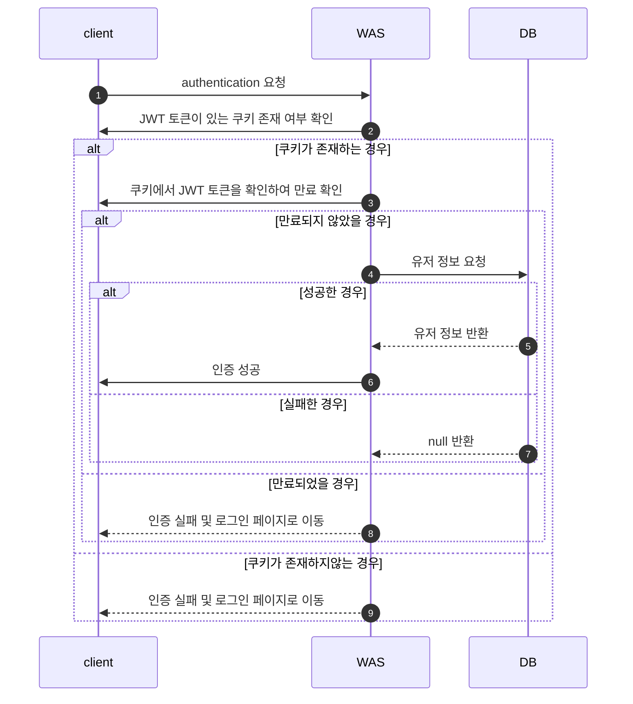

# My3D

## Flow Chart

1. [회원가입](#1-회원가입)
2. [로그인](#2-로그인)
3. [Authentication (인증)](#3-authentication-인증)
4. 게시글 작성
5. 게시글 삭제
6. 게시글 수정
7. 게시글 파일 저장
8. 좋아요 기능 
9. 댓글 기능
10. 알람 기능
11. 주문 기능

### 1. 회원가입

### 2. 로그인

### 3. Authentication (인증)

