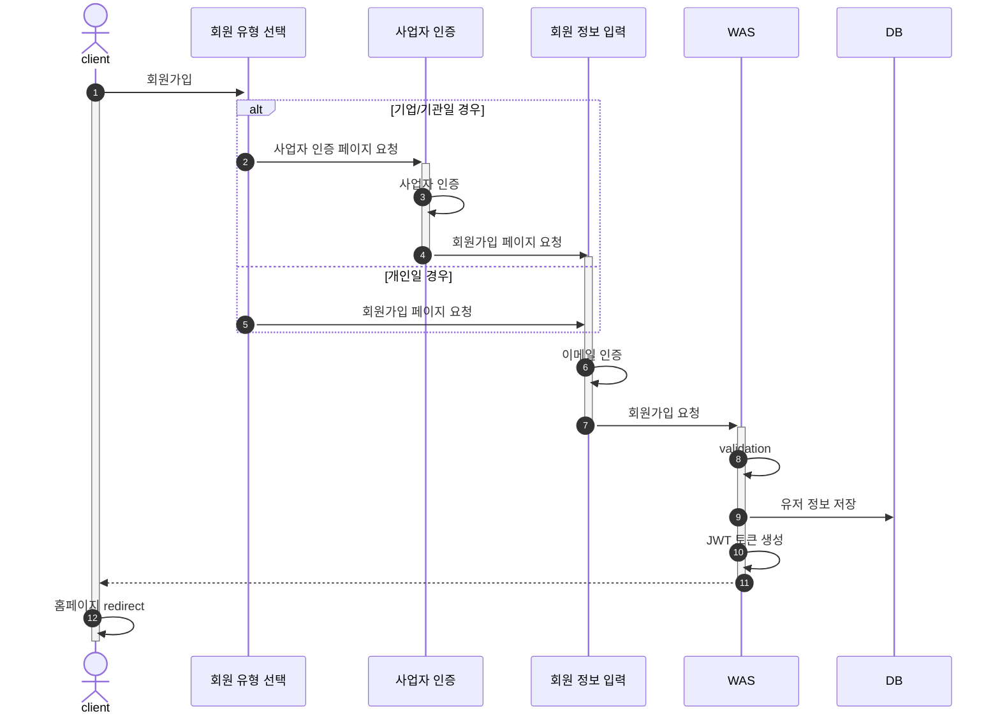
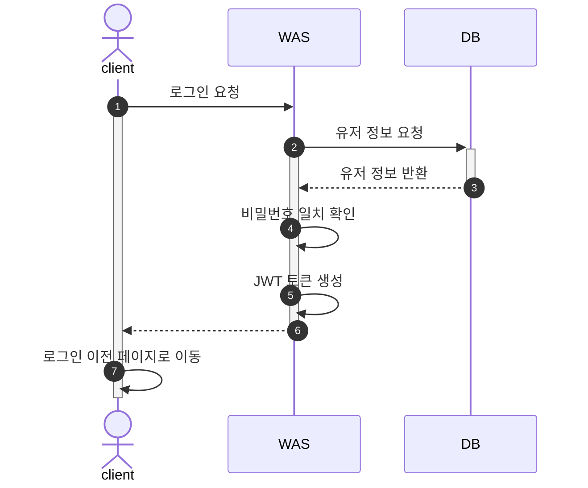
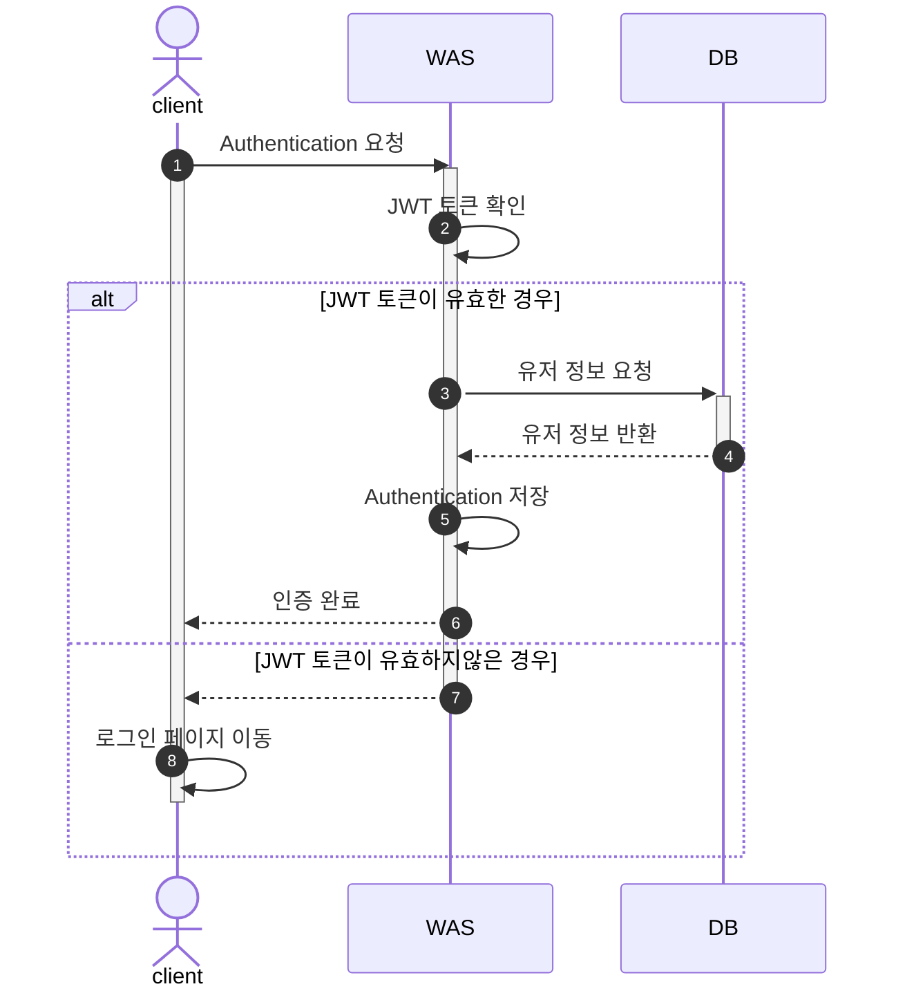
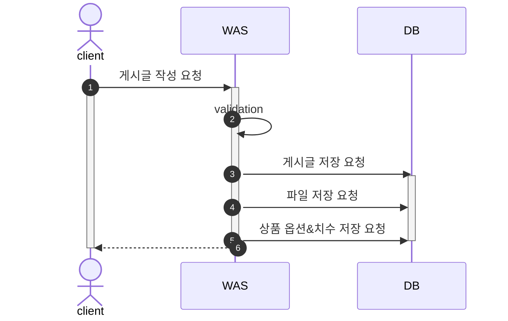
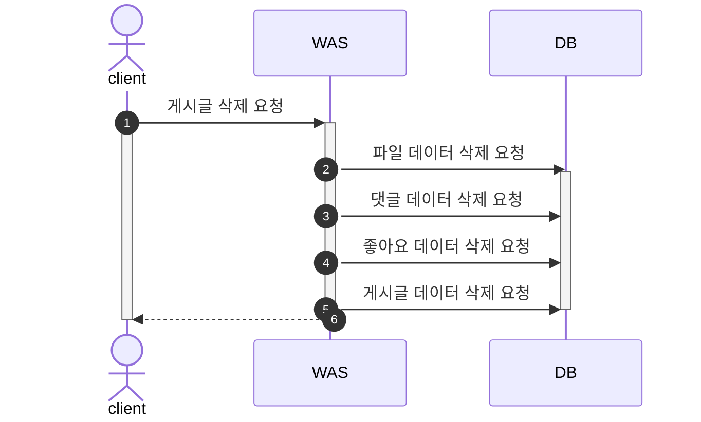
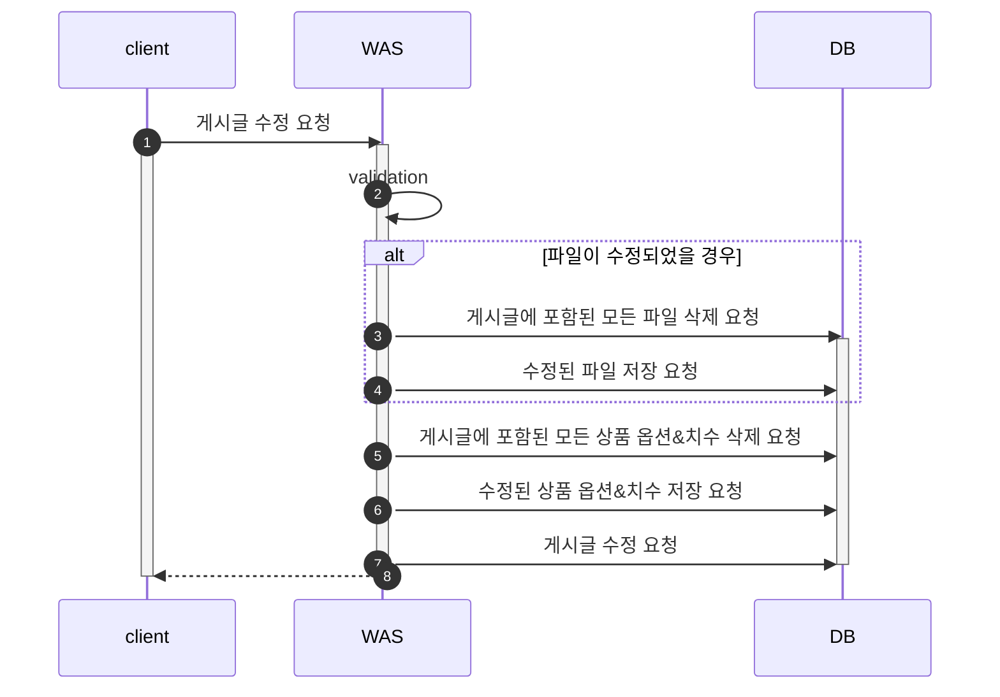
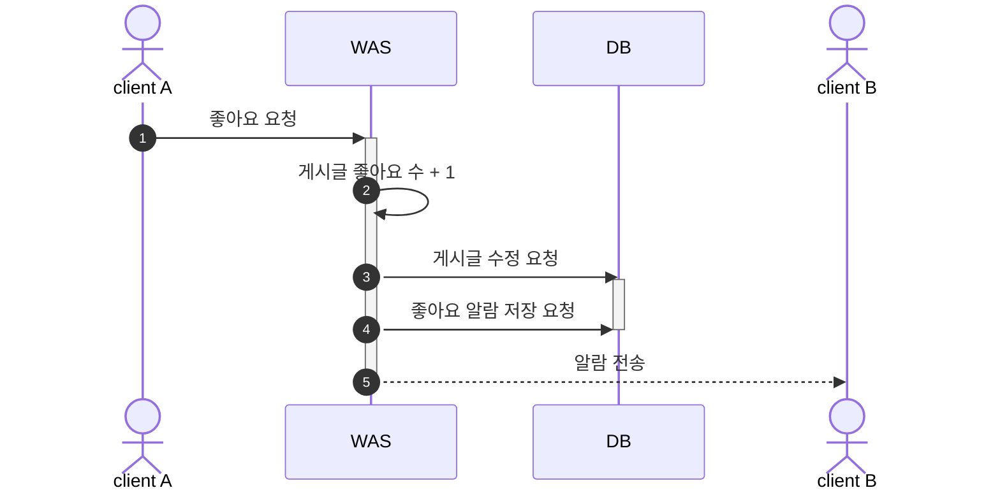
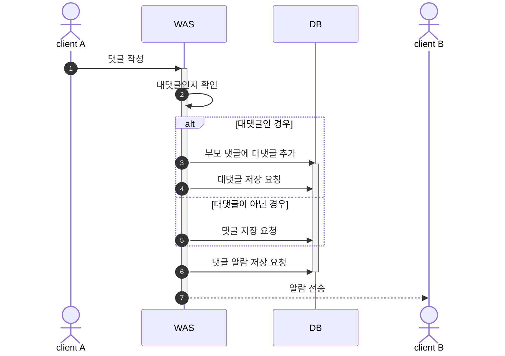
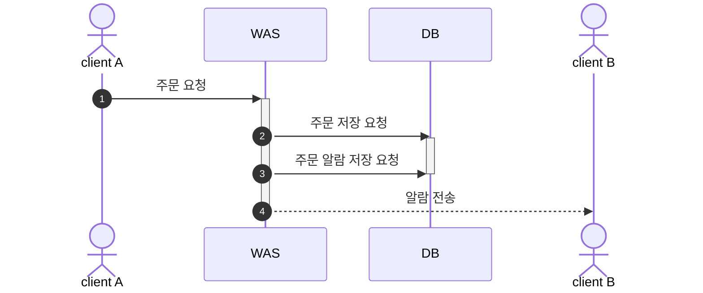

# My3D

## Flow Chart

1. [회원가입](#1-회원가입)
2. [로그인](#2-로그인)
3. [Authentication (인증)](#3-authentication-인증)
4. [게시글 작성](#4-게시글-작성)
5. [게시글 삭제](#5-게시글-삭제)
6. [게시글 수정](#6-게시글-수정)
7. [좋아요 기능](#7-좋아요-기능-user-a가-b-게시물에-좋아요를-누른-상황) 
8. [댓글 기능](#8-댓글-기능-user-a가-b-게시물에-댓글을-남긴-상황)
9. [주문 기능](#9-주문-기능-user-a가-b에게-주문을-요청한-상황)

### 1. 회원가입

### 2. 로그인

### 3. Authentication (인증)

### 4. 게시글 작성

### 5. 게시글 삭제

### 6. 게시글 수정

### 7. 좋아요 기능: User A가 B 게시물에 좋아요를 누른 상황

### 8. 댓글 기능: User A가 B 게시물에 댓글을 남긴 상황

### 9. 주문 기능: User A가 B에게 주문을 요청한 상황

