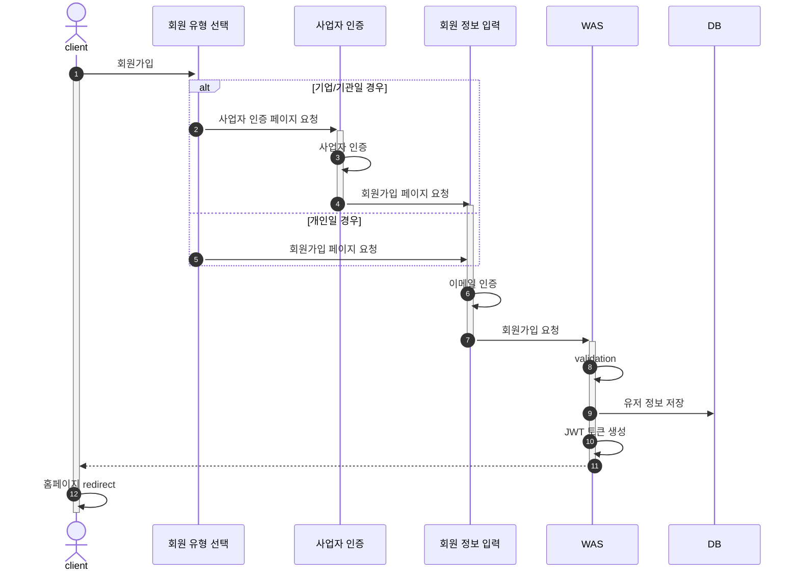
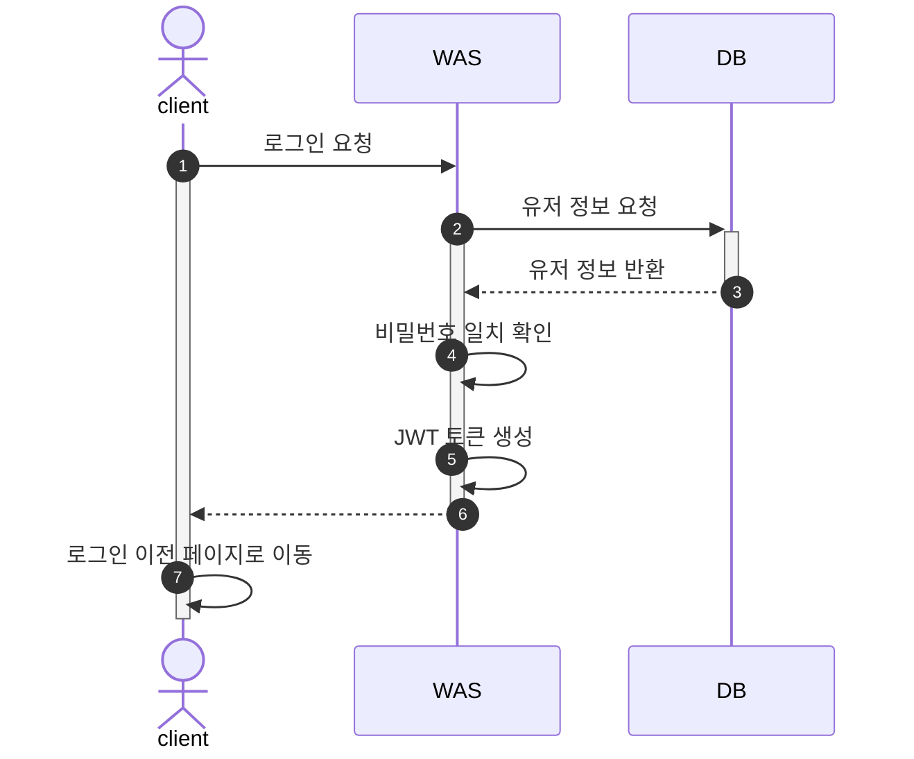
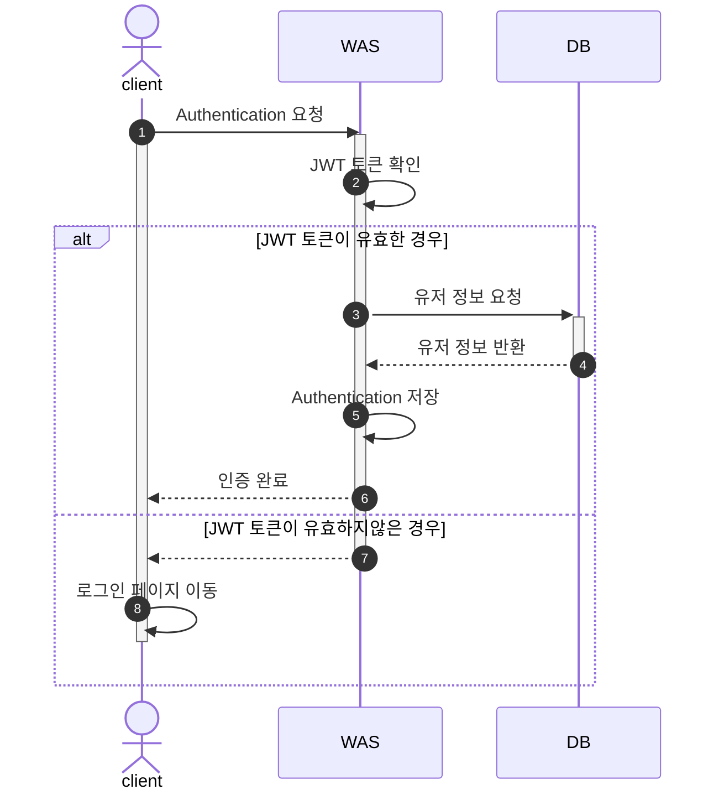
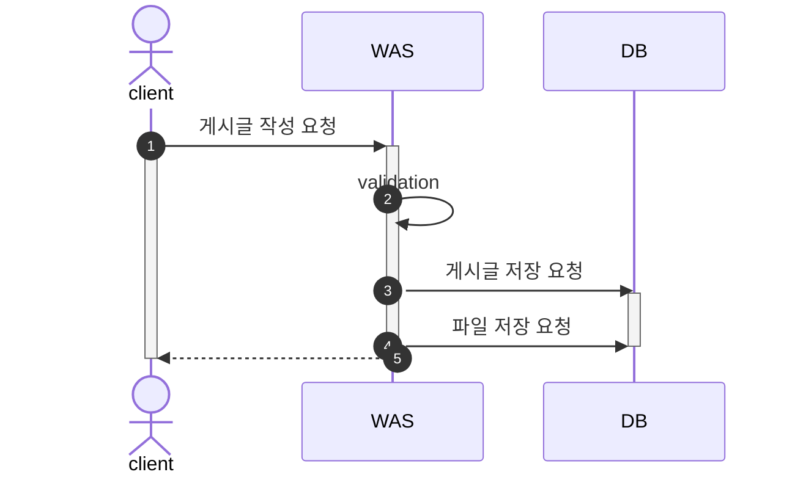
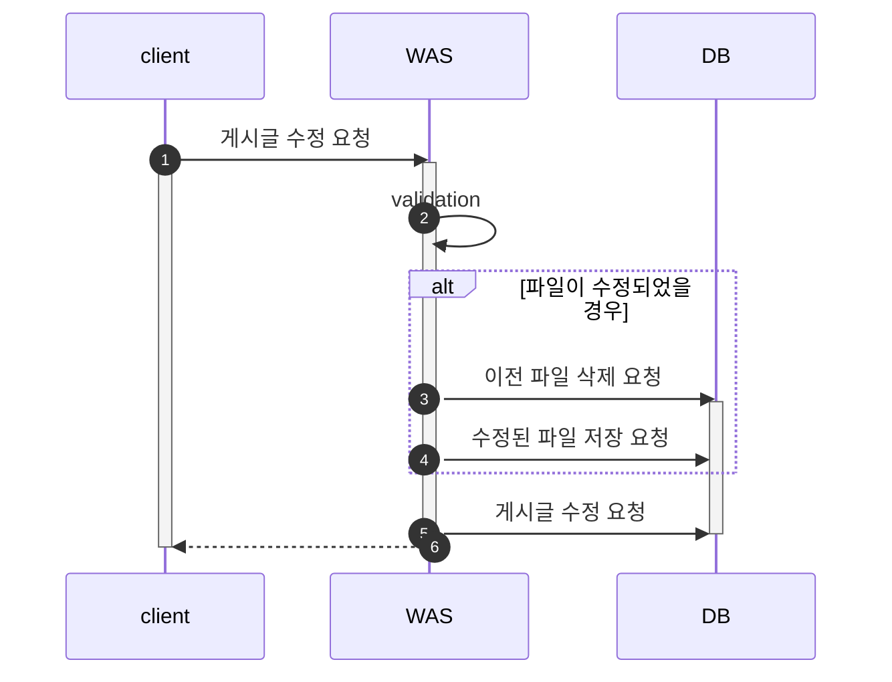
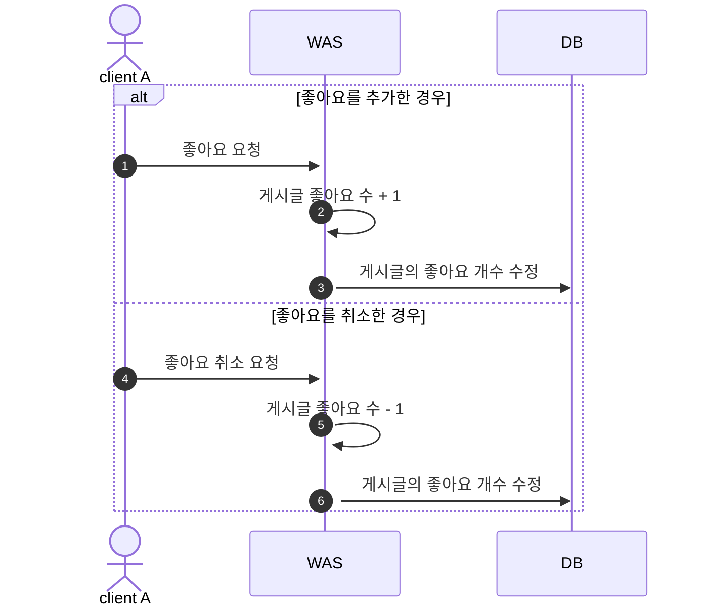
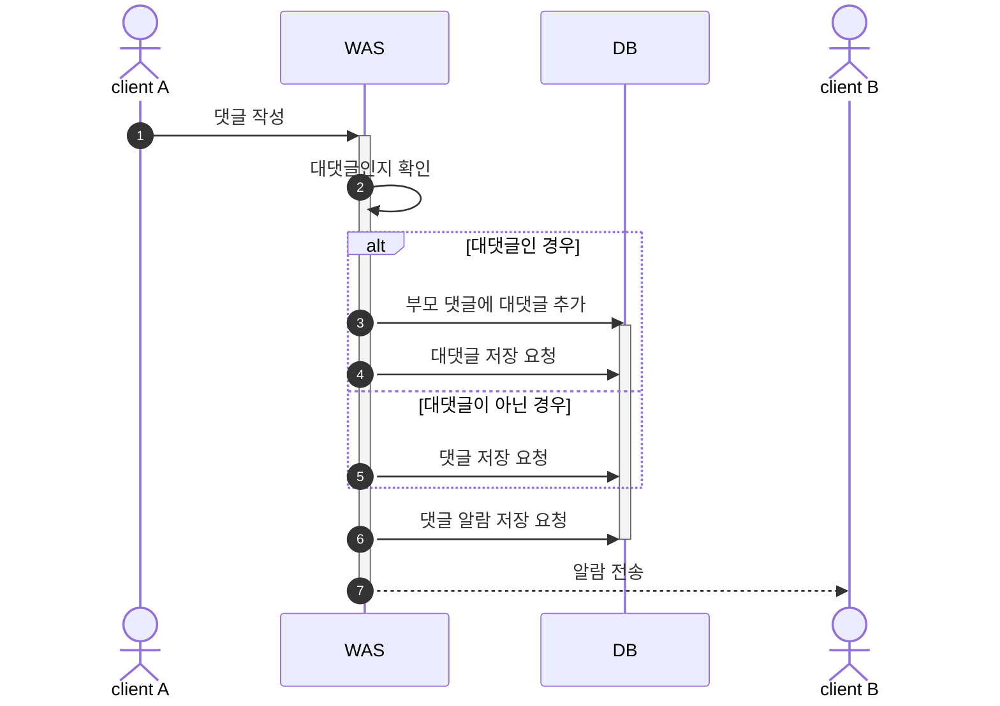

# My3D

## Project Structure

## Development Environment

- Intellij IDEA Ultimate 2023.2.4
- Java 17
- Gradle 8.2.1
- Spring Boot 2.7.14

## Tech Stack

#### FrontEnd  

- Framework  

#### BackEnd

- Framework  

- Template Engine  

- Security  

- DB  

#### PaaS 

- Server  

- Storage  

- DB  

#### Web Server

- Reverse Proxy  

#### CI/CD

## Flow Chart

1. [회원가입](#1-회원가입)
2. [로그인](#2-로그인)
3. [Authentication (인증)](#3-authentication-인증)
4. [게시글 작성](#4-게시글-작성)
5. [게시글 수정](#5-게시글-수정)
6. [좋아요 기능](#6-좋아요-기능-user-a가-b-게시물에-좋아요를-누른-상황) 
7. [댓글 기능](#7-댓글-기능-user-a가-b-게시물에-댓글을-남긴-상황)

### 1. 회원가입

### 2. 로그인

### 3. Authentication (인증)

### 4. 게시글 작성

### 5. 게시글 수정

### 6. 좋아요 기능: User A가 B 게시물에 좋아요를 누른 상황

### 7. 댓글 기능: User A가 B 게시물에 댓글을 남긴 상황

