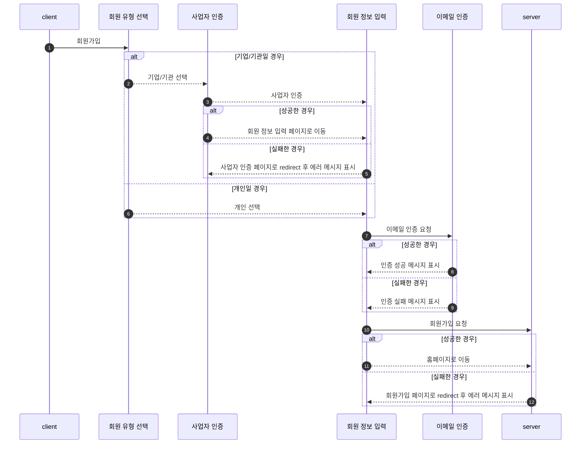

# My3D

## Flow Chart

### 1. 회원가입

```mermaid
  sequenceDiagram
    autonumber
    client ->> 회원 유형 선택: 회원가입
    alt 기업/기관일 경우
        회원 유형 선택 -->> 사업자 인증: 기업/기관 선택
        사업자 인증 -->> 회원 정보 입력: 사업자 인증
        alt 성공한 경우
            사업자 인증 -->> 회원 정보 입력: 회원 정보 입력 페이지로 이동
        else 실패한 경우
            회원 정보 입력 -->> 사업자 인증: 사업자 인증 페이지로 redirect 후 에러 메시지 표시
        end
    else 개인일 경우
        회원 유형 선택 -->> 회원 정보 입력: 개인 선택
    end
    회원 정보 입력 ->> 이메일 인증: 이메일 인증 요청
    alt 성공한 경우
        이메일 인증 -->> 회원 정보 입력: 인증 성공 메시지 표시
    else 실패한 경우
        이메일 인증 -->> 회원 정보 입력: 인증 실패 메시지 표시
    end
    회원 정보 입력 ->> server: 회원가입 요청
    alt 성공한 경우
        회원 정보 입력 -->> server: 홈페이지로 이동
    else 실패한 경우
        server -->> 회원 정보 입력: 회원가입 페이지로 redirect 후 에러 메시지 표시
    end
```
