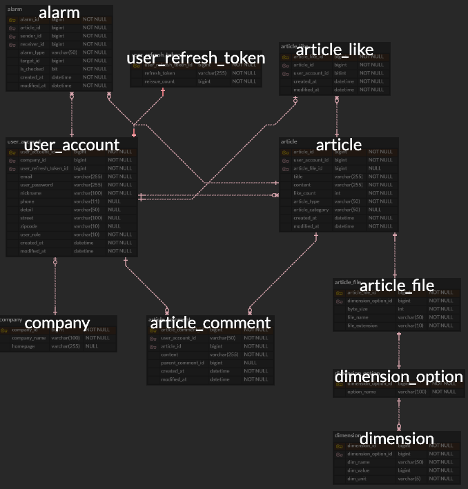

# My3D

3D 모델 중에는 재사용 가능한 것들이 많습니다. 그래서 누구나 3D 모델을 공유하여 사용할 수 있도록하는 서비스입니다.

- [Project Structure](#project-structure)
- [Tech Stack](#tech-stack)
- [Preview](#preview)
- [Flow Chart](#flow-chart)
- [ERD](#erd)

## Project Structure

## Development Environment

- Intellij IDEA Ultimate 2023.2.4
- Java 17
- Gradle 8.2.1
- Spring Boot 2.7.14

## Tech Stack

| FrontEnd                                                                                                                                                                                                                                                                                                                      |
|-------------------------------------------------------------------------------------------------------------------------------------------------------------------------------------------------------------------------------------------------------------------------------------------------------------------------------|
|    |
|                                                                                                                                                                                                          | 
| ️                                                                                                                                                                                                        |

| BackEnd                                                                                                                                                                                                                                                                                                                                                                                                                                                                                                                                                                                                 |
|---------------------------------------------------------------------------------------------------------------------------------------------------------------------------------------------------------------------------------------------------------------------------------------------------------------------------------------------------------------------------------------------------------------------------------------------------------------------------------------------------------------------------------------------------------------------------------------------------------|
|   |
|   |
|  |
|                                                                                                                                                                                                                                                                                                                                                                                                                                                                                 |
|                                                                                                                                                                                                                                                                                                                                                                                                                                                                                                             |

| DevOps                                                                                                                                                                                                                                                                                                                                                                                                                                      |
|---------------------------------------------------------------------------------------------------------------------------------------------------------------------------------------------------------------------------------------------------------------------------------------------------------------------------------------------------------------------------------------------------------------------------------------------|
|     |
|                                                                                                                                                                                                                                   |
|                                                                                                                                                                                                                                                                                                                                                                                                                                           |

| 자동 배포화                                                                                                                                                                                                                                                             | 
|--------------------------------------------------------------------------------------------------------------------------------------------------------------------------------------------------------------------------------------------------------------------|
|   |

## Preview

### 메인 페이지

- 카테고리별 게시글 검색 가능
- 좋아요, 작성일자 기준 게시글 정렬 가능
- 게시글 제목 검색 가능

### 게시글 페이지

- 게시글 수정/삭제 가능
- 좋아요 추가/삭제 가능
- 파일 다운로드 가능
- 댓글/대댓글 작성 가능
- 댓글 작성시 알람 전송

### 게시글 작성 페이지

- 제목, 본문, 파일, 치수 정보, 카테고리 입력

### 로그인 & 비밀번호 찾기 페이지

- 구글, 네이버, 카카오 로그인 가능
- 비밀번호 찾기 가능

### 회원가입 페이지

- 기업 유저는 사업자 인증을 수행
- 기업/일반 유저는 본인 인증을 목적으로 이메일 인증을 수행

### 유저 정보 수정 페이지

- 일반 유저와 기업 유저 구분
- 기업 유저는 기업 정보를 수정할 수 있는 페이지가 추가됨

## Flow Chart

1. [회원가입](#1-회원가입)
2. [로그인](#2-로그인)
3. [Authentication (인증)](#3-authentication-인증)
4. [알람](#4-알람)

### 1. 회원가입

### 2. 로그인

### 3. Authentication (인증)

### 4. 알람

#### 4.1. 페이지 전환

#### 4.2. 이벤트 발생 (댓글 작성)

## ERD

- 이미지를 클릭하면 ERDCloud 페이지로 이동합니다.

